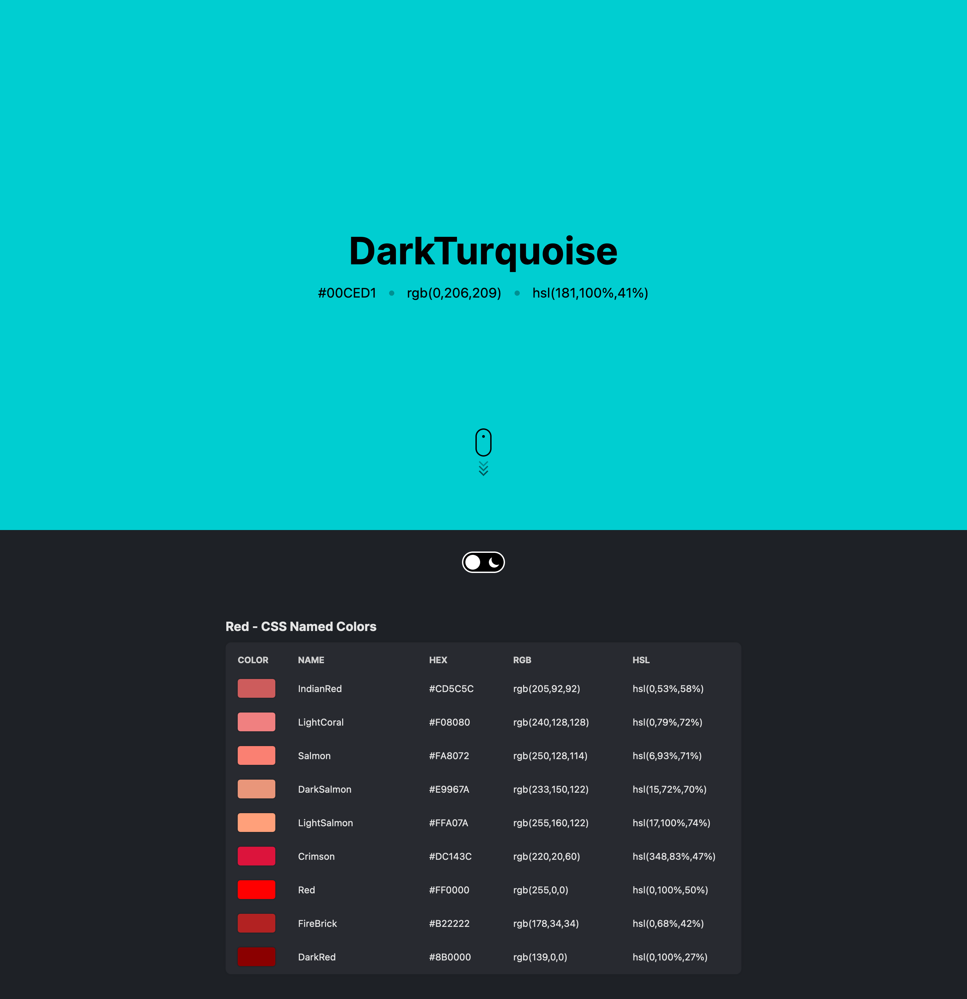

# CSS Named Colors



## Getting Started

Install the Node modules.

```
npm install
```

Run the development server

```
npm run start
```

Open [http://localhost:3000](http://localhost:3000) with your browser to see the application.

## Built with
- [Create React App](https://create-react-app.dev/)
- [Styled-Components](https://styled-components.com/)
- [Vercel](https://vercel.com/)